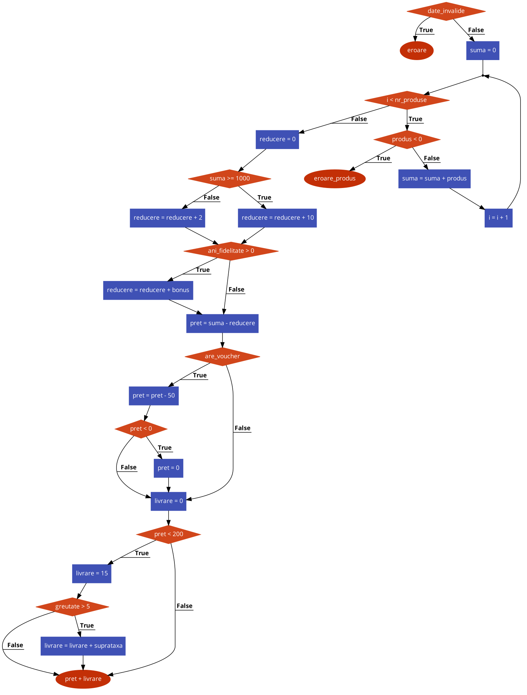

# Testarea Sistemelor Software - T3 Testare unitară în Java - JUnit 5 
**Membrii echipei:**
 - Bunescu Robert
 - Furtuna Vlad

---

## 1. Configurația Mediului de Testare

### 1.1 Configurația Hardware

### 1.2 Configurația Software și Versiuni Tool-uri

---

## 2. Diagrame

### 2.1 Graficul de Flux de Control (Control Flow Graph)

---

## 3. Strategii de Testare Aplicate

### 3.1 Partiționare în clase de echivalență

### 3.2 Analiza valorilor de frontieră (BVA)

### 3.3 Acoperire la nivel de instrucțiune, decizie și condiție

### 3.4 Circuite independente

---

## 4. Analiza Mutanților (Mutation Testing)

### 4.1 Captură de ecran cu rezultatul inițial

### 4.2 Comparație Mutanți (Tabelar)

### 4.3 Captură de ecran cu rezultatul final

---

## 5. Raport privind Utilizarea Inteligenței Artificiale

---

## 6. Prezentare și Demo

---

## Bibliografie
