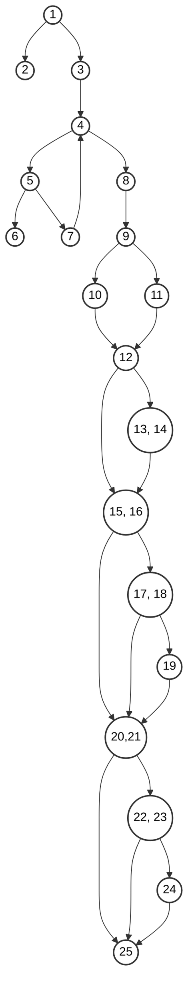

# Testarea Sistemelor Software - T3 Testare unitară în Java - JUnit 5 
**Membrii echipei:**
 - Bunescu Robert
 - Furtuna Vlad

---

## 1. Descriere Generală

Modulul `ProcesorComanda` are rolul de a calcula prețul final de plată pentru un coș de cumpărături, aplicând dinamic o serie de reduceri procentuale, vouchere valorice și taxe de livrare (inclusiv penalizări de greutate), în funcție de profilul clientului și detaliile comenzii.

### 1.1. Date de Intrare (Parametri)

Sistemul primește următoarele informații pentru fiecare comandă:

* **`preturiProduse`**: O listă (array) de numere reale reprezentând prețurile individuale ale produselor din coș.
* **`aniFidelitate`**: Un număr întreg reprezentând vechimea clientului (în ani).
* **`areVoucher`**: O valoare booleană (Adevărat/Fals) care indică dacă clientul a aplicat un cod de reducere fix.
* **`greutateColet`**: Un număr real reprezentând greutatea totală a pachetului (în kilograme).
* **`isVIP`**: O valoare booleană (Adevărat/Fals) care indică dacă clientul face parte din programul Premium/VIP.

### 1.2. Pre-condiții (Reguli de Validare)

Sistemul trebuie să respingă automat procesarea și să ridice o excepție (`IllegalArgumentException`) dacă oricare dintre următoarele condiții nu este respectată:

1. Lista de prețuri este nulă (inexistentă) sau goală (nu conține niciun produs).
2. Greutatea coletului este un număr strict negativ (`< 0`).
3. Anii de fidelitate reprezintă un număr strict negativ (`< 0`).
4. Oricare dintre prețurile din lista de produse este un număr strict negativ (`< 0`).

### 1.3. Reguli de Business (Procesare)

**1.3.1. Calculul Sumei Inițiale**

* Sistemul va calcula suma inițială prin adunarea tuturor prețurilor valide din lista de produse.

**1.3.2. Acordarea Reducerilor Procentuale**
Se aplică o singură reducere globală, calculată după cum urmează:

* **Reducerea de bază:** 
  * Clienții VIP **sau** clienții a căror sumă inițială atinge sau depășește pragul de `1000.0` lei vor primi o reducere de **10%**.
  * Toți ceilalți clienți vor primi o reducere standard de **2%**.


* **Bonusul de fidelitate:** 
  * Se aplică **doar clienților non-VIP** care au o vechime mai mare de 0 ani.
  * Se adaugă **1% extra-reducere pentru fiecare an** de fidelitate.
  * Acest bonus extra este plafonat la maximum **5%** (chiar dacă clientul are mai mult de 5 ani vechime).


**Suma totala** se actualizează scăzând procentul total de reducere calculat din suma inițială.

**1.3.3. Aplicarea Voucherului Fix**

* Dacă clientul deține un voucher (`areVoucher == true`), se va scădea o valoare fixă de **50.0 lei** din suma obținută după aplicarea reducerilor procentuale.
* Dacă în urma aplicării voucherului suma totală devine negativă, aceasta **va fi plafonată la 0.0 lei** (clientul nu poate primi bani înapoi).

**1.3.4. Calculul Costurilor de Livrare**
Taxa de transport se calculează în funcție de suma finală a produselor (după toate reducerile și voucherele) și de greutatea coletului:

* **Livrare gratuită:** 
  * Dacă suma produselor este mai mare sau egală cu `200.0` lei, costul de livrare este **0 lei**.
* **Livrare cu taxă:** 
  * Dacă suma produselor scade sub pragul de `200.0` lei, se aplică o taxă de bază de **15.0 lei**.
* **Suprataxă de greutate:** 
  * Se aplică *doar dacă comanda nu beneficiază de livrare gratuită* și dacă greutatea coletului depășește pragul de **5.0 kg**. 
  * Pentru fiecare kilogram suplimentar peste pragul de 5.0 kg, se va adăuga o penalizare de **2.0 lei**.

### 1.4. Post-condiții (Ieșiri)

* Sistemul trebuie să returneze un număr real pozitiv, reprezentând costul final pe care clientul trebuie să-l achite.
* Această valoare finală (Suma produselor + Cost livrare) trebuie rotunjită matematic la **exact 2 zecimale** înainte de a fi returnată.

---

## 2. Configurația Mediului de Testare

### 2.1 Configurația Hardware
Compatibil cu majoritatea configuratiilor hardware. A fost rulat pe:
* **Sistem de operare:** macOS Tahoe
* **Procesor (CPU):** Apple M1 / M1 PRO
* **Memorie RAM:** 16 GB / 32 GB 

### 2.2 Configurația Software și Versiuni Tool-uri
Proiectul folosește **Maven** ca utilitar de build și management al dependențelor.
* **Java (JDK):** Versiunea 24
* **Framework de testare:** JUnit Jupiter (JUnit 5) - Versiunea `5.13.4`
* **Acoperire de cod (Code Coverage):** JaCoCo Maven Plugin - Versiunea `0.8.14`
* **Testare pe bază de mutanți (Mutation Testing):** PITest Maven Plugin - Versiunea `1.19.4` (cu extensia `pitest-junit5-plugin` versiunea `1.2.3`)

### 2.3 Comenzi de Rulare a Testelor și Generare Rapoarte
Pentru a reproduce mediul și a vizualiza rapoartele din consolă, se vor folosi următoarele comenzi în directorul rădăcină al proiectului:

**A. Rulare teste și generare raport de acoperire (JaCoCo):**
1. Executarea testelor și construirea raportului:
```bash
mvn clean test
```

2. Deschiderea raportului JaCoCo (pe macOS/Linux):
```bash
open target/site/jacoco/index.html
```


*(Pentru Windows se poate folosi `start target/site/jacoco/index.html`)*

**B. Rulare generare mutanți (PITest):**

1. Rularea analizei de mutații:
```bash
mvn org.pitest:pitest-maven:mutationCoverage -DtargetClasses='proiect_testare.*' -DtargetTests='proiect_testare.*'

```


2. Deschiderea raportului PITest:
```bash
open target/pit-reports/index.html

```

---

## 3. Diagrame

### 3.1 Graficul de Flux de Control (Control Flow Graph)

Mai jos este reprezentat Graful Fluxului de Control (CFG) pentru metoda `calculeazaPretFinal`, extras pe baza implementării Java conform metodologiei de testare structurală. Graful utilizează blocuri de bază pentru a grupa secvențele liniare de instrucțiuni , evidențiind clar punctele de decizie: validarea parametrilor, procesarea repetitivă a produselor în buclă, logica de reducere (praguri de sumă, statut VIP și fidelitate), precum și ramificațiile pentru aplicarea voucherelor și calculul costurilor de livrare:


```mermaid
graph TD
    classDef default fill:#fff,stroke:#333,stroke-width:2px,color:#000;
    
    1(("1"))
    2(("2"))
    3(("3"))
    4(("4"))
    5(("5"))
    6(("6"))
    7(("7"))
    8(("8"))
    9(("9"))
    10(("10"))
    11(("11"))
    12(("12"))
    13_14(("13, 14"))
    15_16(("15, 16"))
    17_18(("17, 18"))
    19(("19"))
    20_21(("20,21"))
    22_23(("22, 23"))
    24(("24"))
    25(("25"))

    %% 1. Validare initiala
    1 --> 2
    1 --> 3
    
    %% Inainte de bucla
    3 --> 4
    
    %% Bucla for
    4 --> 5
    4 --> 8
    
    5 --> 6
    5 --> 7
    7 --> 4
    
    %% Reducere de baza
    8 --> 9
    9 --> 10
    9 --> 11
    10 --> 12
    11 --> 12
    
    %% Fidelitate
    12 --> 13_14
    12 --> 15_16
    13_14 --> 15_16
    
    %% Voucher (cu IF imbricat)
    
    15_16 --> 17_18
    15_16 --> 20_21
    17_18 --> 19
    17_18 --> 20_21
    19 --> 20_21
    
    %% Costuri Livrare (cu IF imbricat)
    20_21 --> 22_23
    20_21 --> 25
    22_23 --> 24
    22_23 --> 25
    24 --> 25
```


### Maparea Nodurilor

1. `if (preturiProduse == null || preturiProduse.length == 0 || greutateColet < 0 || aniFidelitate < 0)`
2. `throw new IllegalArgumentException("Date de intrare invalide");`
3. `double sumaInitiala = 0.0;`
4. `for (int i = 0; i < preturiProduse.length; i++)`
5. `if (preturiProduse[i] < 0)`
6. `throw new IllegalArgumentException("Pretul unui produs nu poate fi negativ");`
7. `sumaInitiala += preturiProduse[i];`
8. `double reducere = 0.0;`
9. `if (sumaInitiala >= 1000.0 || isVIP)`
10. `reducere = 0.10;`
11. `reducere = 0.02;`
12. `if (aniFidelitate > 0 && !isVIP)`
13. `double extraReducere = Math.min(aniFidelitate * 0.01, 0.05);`
14. `reducere += extraReducere;`
15. `double sumaDupaReducere = sumaInitiala * (1.0 - reducere);`
16. `if (areVoucher)`
17. `sumaDupaReducere -= 50.0;`
18. `if (sumaDupaReducere < 0)`
19. `sumaDupaReducere = 0.0;`
20. `double costLivrare = 0.0;`
21. `if (sumaDupaReducere < 200.0)`
22. `costLivrare = 15.0;`
23. `if (greutateColet > 5.0)`
24. `costLivrare += (greutateColet - 5.0) * 2.0;`
25. `return Math.round((sumaDupaReducere + costLivrare) * 100.0) / 100.0;`


---

## 4. Strategii de Testare Aplicate

### 4.1 Partiționare în clase de echivalență

Am împărțit domeniul datelor de intrare în clase valide și invalide, asumând că datele din aceeași clasă sunt procesate identic de `ProcesorComanda`.

* **Clase Invalide:** Array-uri nule/goale pentru prețuri, greutate negativă, ani de fidelitate negativi.
* **Clase Valide:** Comenzi de valoare mică/mare, clienți VIP vs. standard, utilizarea voucherului vs. neutilizare.
* *Implementare:* Clasa `ProcesorComandaEPTest`.

### 4.2 Analiza valorilor de frontieră (BVA)

Ne-am concentrat pe limitele claselor de echivalență (unde apar de obicei erori de tipul `<` în loc de `<=`).

* **Pragul de reducere de 10%:** Testat exact la `1000.0` (acordă 10%) și la `999.9` (acordă 2%).
* **Greutatea coletului (suprataxă):** Testat la `0.0`, `5.0` (limită fără suprataxă) și `5.1` (aplicare suprataxă de 2 lei/kg).
* **Livrare gratuită:** Pragul sumei post-reducere testat la valoare sub `200` și peste `200`.
* **Plafonare Fidelitate:** Verificarea reducerii de fidelitate maximă la anii 4, 5 (limită) și 6 (peste limită, plafonat la 5%).
* *Implementare:* Clasa `ProcesorComandaBVATest`.

### 4.3 Acoperire la nivel de instrucțiune, decizie și condiție

* **Instrucțiune & Decizie:** Toate ramurile (`if`/`else`) au fost vizitate măcar o dată (ex. intrare pe ramura de voucher valabil, clamparea valorii negative la 0.0 etc.).
* **Condiție (Condition Coverage):** Am analizat deciziile compuse (ex: `if (sumaInitiala >= 1000.0 || isVIP)` și `if (aniFidelitate > 0 && !isVIP)`). Am creat teste specifice pentru a evalua independența clauzelor (ex: C1 True și C2 False, urmat de C1 False și C2 True), demonstrând că fiecare condiție individuală dictează rezultatul expresiei logice.
* *Implementare:* Clasa `ProcesorComandaWhiteBoxTest`.

### 4.4 Circuite independente

Pe baza complexității ciclomatice a funcției (calculată prin formula lui McCabe, $V(G) = E - N + 2P$), am conceput teste care să urmeze trasee (path-uri) independente. De exemplu, un circuit testează scenariul critic care ocolește reducerea mare, nu aplică voucher, dar aplică dublă penalizare (taxă de livrare standard + suprataxă de greutate extremă).

---

## 5. Analiza Mutanților (Mutation Testing)

Am utilizat PITest pentru a injecta mutanți artificiali (defecte) în codul sursă. Scopul a fost ca testele noastre să pice (să "ucidă" mutantul) la întâlnirea acestor modificări.

### 5.1 Captură de ecran cu rezultatul inițial

*[ todo - imagine cu raportul PITest fara teste de mutanti ]*

### 5.2 Comparație Mutanți

Mai jos sunt prezentați doi mutanți neechivalenți care au supraviețuit inițial și pe care i-am eliminat adăugând teste stricte de white-box.

| Linia Modificată | Mutant Injected de PITest | Explicație & Testul care îl ucide | Status |
| --- | --- | --- | --- |
| `if (sumaInitiala >= 1000.0)` | A schimbat `>=` cu `>` (Conditionals Boundary) | Testul `testMutation_UcideMutantStrictMaiMare` trimite exact suma 1000.0. Mutantul acorda doar 2% (în loc de 10%), forțând `assertEquals(900.0, ...)` să pice. | **KILLED** |
| `Math.min(aniFidelitate * 0.01, 0.05)` | A schimbat apelul `Math.min` cu `Math.max` | Testul `testMutation_UcideMutantMathMinMax` folosește 1 an de fidelitate. Mutantul aplica direct 5% (max), în loc de 1% (min), forțând testul să pice pe calculul final. | **KILLED** |
| `sumaDupaReducere -= 50.0;` | A schimbat scăderea `-=` cu adunare `+=` | Testul `testMutation_UcideMutantPlusMinusVoucher` folosește un voucher pe un coș valid. Mutantul crește prețul în loc să-l scadă, picând aserția sumei finale. | **KILLED** |

### 5.3 Captură de ecran cu rezultatul final

*[ todo - imagine cu raportul PITest cu mutation coverage ridicat ]*

---

## 6. Raport privind Utilizarea Inteligenței Artificiale

Pentru realizarea acestui proiect, am utilizat asistență AI (Gemini) având următoarele roluri:

* **Generare boilerplate:** Structurarea inițială a claselor de test (setup JUnit 5).
* **Formatare:** Generarea scheletului curent în format Markdown.

---

## 7. Prezentare și Demo

*[ powerpoint ]*

---

## Bibliografie

1. Curs 1: Testare Funcțională (Black-Box: EP, BVA).
2. Curs 2: Testare Structurală (White-Box: CFG, Coverage Instrucțiuni/Decizii/Condiții, Ciclomatică McCabe).
3. Documentație oficială JUnit 5: https://junit.org/junit5/docs/current/user-guide/
4. Documentație oficială PITest: https://pitest.org/quickstart/maven/
5. Documentație oficială JaCoCo: https://www.jacoco.org/jacoco/trunk/doc/maven.html
