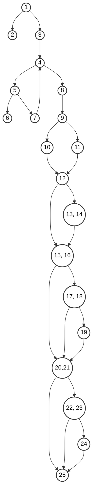

# Testarea Sistemelor Software - T3 Testare unitară în Java - JUnit 5 
**Membrii echipei:**
 - Bunescu Robert
 - Furtuna Vlad

---

## 1. Descriere Generală

Modulul `ProcesorComanda` are rolul de a calcula prețul final de plată pentru un coș de cumpărături, aplicând dinamic o serie de reduceri procentuale, vouchere valorice și taxe de livrare (inclusiv penalizări de greutate), în funcție de profilul clientului și detaliile comenzii.

### 1.1. Date de Intrare (Parametri)

Sistemul primește următoarele informații pentru fiecare comandă:

* **`preturiProduse`**: O listă (array) de numere reale reprezentând prețurile individuale ale produselor din coș.
* **`aniFidelitate`**: Un număr întreg reprezentând vechimea clientului (în ani).
* **`areVoucher`**: O valoare booleană (Adevărat/Fals) care indică dacă clientul a aplicat un cod de reducere fix.
* **`greutateColet`**: Un număr real reprezentând greutatea totală a pachetului (în kilograme).
* **`isVIP`**: O valoare booleană (Adevărat/Fals) care indică dacă clientul face parte din programul Premium/VIP.

### 1.2. Pre-condiții (Reguli de Validare)

Sistemul trebuie să respingă automat procesarea și să ridice o excepție (`IllegalArgumentException`) dacă oricare dintre următoarele condiții nu este respectată:

1. Lista de prețuri este nulă (inexistentă) sau goală (nu conține niciun produs).
2. Greutatea coletului este un număr strict negativ (`< 0`).
3. Anii de fidelitate reprezintă un număr strict negativ (`< 0`).
4. Oricare dintre prețurile din lista de produse este un număr strict negativ (`< 0`).

### 1.3. Reguli de Business (Procesare)

**1.3.1. Calculul Sumei Inițiale**

* Sistemul va calcula suma inițială prin adunarea tuturor prețurilor valide din lista de produse.

**1.3.2. Acordarea Reducerilor Procentuale**
Se aplică o singură reducere globală, calculată după cum urmează:

* **Reducerea de bază:** 
  * Clienții VIP **sau** clienții a căror sumă inițială atinge sau depășește pragul de `1000.0` lei vor primi o reducere de **10%**.
  * Toți ceilalți clienți vor primi o reducere standard de **2%**.


* **Bonusul de fidelitate:** 
  * Se aplică **doar clienților non-VIP** care au o vechime mai mare de 0 ani.
  * Se adaugă **1% extra-reducere pentru fiecare an** de fidelitate.
  * Acest bonus extra este plafonat la maximum **5%** (chiar dacă clientul are mai mult de 5 ani vechime).


**Suma totala** se actualizează scăzând procentul total de reducere calculat din suma inițială.

**1.3.3. Aplicarea Voucherului Fix**

* Dacă clientul deține un voucher (`areVoucher == true`), se va scădea o valoare fixă de **50.0 lei** din suma obținută după aplicarea reducerilor procentuale.
* Dacă în urma aplicării voucherului suma totală devine negativă, aceasta **va fi plafonată la 0.0 lei** (clientul nu poate primi bani înapoi).

**1.3.4. Calculul Costurilor de Livrare**
Taxa de transport se calculează în funcție de suma finală a produselor (după toate reducerile și voucherele) și de greutatea coletului:

* **Livrare gratuită:** 
  * Dacă suma produselor este mai mare sau egală cu `200.0` lei, costul de livrare este **0 lei**.
* **Livrare cu taxă:** 
  * Dacă suma produselor scade sub pragul de `200.0` lei, se aplică o taxă de bază de **15.0 lei**.
* **Suprataxă de greutate:** 
  * Se aplică *doar dacă comanda nu beneficiază de livrare gratuită* și dacă greutatea coletului depășește pragul de **5.0 kg**. 
  * Pentru fiecare kilogram suplimentar peste pragul de 5.0 kg, se va adăuga o penalizare de **2.0 lei**.

### 1.4. Post-condiții (Ieșiri)

* Sistemul trebuie să returneze un număr real pozitiv, reprezentând costul final pe care clientul trebuie să-l achite.
* Această valoare finală (Suma produselor + Cost livrare) trebuie rotunjită matematic la **exact 2 zecimale** înainte de a fi returnată.

---

## 2. Structura Proiectului

```
testarea_sistemelor_software/
├── README.md
└── _/
    ├── pom.xml
    └── src/
        ├── main/java/proiect_testare/
        │   └── ProcesorComanda.java          ← Clasa testată (logica de business)
        └── test/java/proiect_testare/
            ├── ProcesorComandaBVATest.java    ← 10 teste (Boundary Value Analysis)
            ├── ProcesorComandaEPTest.java     ← 9 teste  (Equivalence Partitioning)
            └── ProcesorComandaWhiteBoxTest.java ← 14 teste (White-Box + Mutation)
```

**Total: 33 teste unitare** distribuite pe 3 clase de test.

---

## 3. Configurația Mediului de Testare

### 3.1 Configurația Hardware
Compatibil cu majoritatea configuratiilor hardware. A fost rulat pe:
* **Sistem de operare:** macOS Tahoe
* **Procesor (CPU):** Apple M1 / M1 PRO
* **Memorie RAM:** 16 GB / 32 GB 

### 3.2 Configurația Software și Versiuni Tool-uri
Proiectul folosește **Maven** ca utilitar de build și management al dependențelor.
* **Java (JDK):** Versiunea 24
* **Framework de testare:** JUnit Jupiter (JUnit 5) - Versiunea `5.13.4`
* **Acoperire de cod (Code Coverage):** JaCoCo Maven Plugin - Versiunea `0.8.14`
* **Testare pe bază de mutanți (Mutation Testing):** PITest Maven Plugin - Versiunea `1.19.4` (cu extensia `pitest-junit5-plugin` versiunea `1.2.3`)

### 3.3 Comenzi de Rulare a Testelor și Generare Rapoarte
Pentru a reproduce mediul și a vizualiza rapoartele din consolă, se vor folosi următoarele comenzi în directorul rădăcină al proiectului:

**A. Rulare teste și generare raport de acoperire (JaCoCo):**
1. Executarea testelor și construirea raportului:
```bash
mvn clean test
```

2. Deschiderea raportului JaCoCo (pe macOS/Linux):
```bash
open target/site/jacoco/index.html
```


*(Pentru Windows se poate folosi `start target/site/jacoco/index.html`)*

**B. Rulare generare mutanți (PITest):**

1. Rularea analizei de mutații:
```bash
mvn org.pitest:pitest-maven:mutationCoverage -DtargetClasses='proiect_testare.*' -DtargetTests='proiect_testare.*'

```


2. Deschiderea raportului PITest:
```bash
open target/pit-reports/index.html

```

---

## 4. Diagrame

### 4.1 Graficul de Flux de Control (Control Flow Graph)

Mai jos este reprezentat Graful Fluxului de Control (CFG) pentru metoda `calculeazaPretFinal`, extras pe baza implementării Java conform metodologiei de testare structurală. Graful utilizează blocuri de bază pentru a grupa secvențele liniare de instrucțiuni , evidențiind clar punctele de decizie: validarea parametrilor, procesarea repetitivă a produselor în buclă, logica de reducere (praguri de sumă, statut VIP și fidelitate), precum și ramificațiile pentru aplicarea voucherelor și calculul costurilor de livrare:


```mermaid
graph TD
    classDef default fill:#fff,stroke:#333,stroke-width:2px,color:#000;
    
    1(("1"))
    2(("2"))
    3(("3"))
    4(("4"))
    5(("5"))
    6(("6"))
    7(("7"))
    8(("8"))
    9(("9"))
    10(("10"))
    11(("11"))
    12(("12"))
    13_14(("13, 14"))
    15_16(("15, 16"))
    17_18(("17, 18"))
    19(("19"))
    20_21(("20,21"))
    22_23(("22, 23"))
    24(("24"))
    25(("25"))

    %% 1. Validare initiala
    1 --> 2
    1 --> 3
    
    %% Inainte de bucla
    3 --> 4
    
    %% Bucla for
    4 --> 5
    4 --> 8
    
    5 --> 6
    5 --> 7
    7 --> 4
    
    %% Reducere de baza
    8 --> 9
    9 --> 10
    9 --> 11
    10 --> 12
    11 --> 12
    
    %% Fidelitate
    12 --> 13_14
    12 --> 15_16
    13_14 --> 15_16
    
    %% Voucher (cu IF imbricat)
    
    15_16 --> 17_18
    15_16 --> 20_21
    17_18 --> 19
    17_18 --> 20_21
    19 --> 20_21
    
    %% Costuri Livrare (cu IF imbricat)
    20_21 --> 22_23
    20_21 --> 25
    22_23 --> 24
    22_23 --> 25
    24 --> 25
```


### 4.1.1 Maparea Nodurilor

1. `if (preturiProduse == null || preturiProduse.length == 0 || greutateColet < 0 || aniFidelitate < 0)`
2. `throw new IllegalArgumentException("Date de intrare invalide");`
3. `double sumaInitiala = 0.0;`
4. `for (int i = 0; i < preturiProduse.length; i++)`
5. `if (preturiProduse[i] < 0)`
6. `throw new IllegalArgumentException("Pretul unui produs nu poate fi negativ");`
7. `sumaInitiala += preturiProduse[i];`
8. `double reducere = 0.0;`
9. `if (sumaInitiala >= 1000.0 || isVIP)`
10. `reducere = 0.10;`
11. `reducere = 0.02;`
12. `if (aniFidelitate > 0 && !isVIP)`
13. `double extraReducere = Math.min(aniFidelitate * 0.01, 0.05);`
14. `reducere += extraReducere;`
15. `double sumaDupaReducere = sumaInitiala * (1.0 - reducere);`
16. `if (areVoucher)`
17. `sumaDupaReducere -= 50.0;`
18. `if (sumaDupaReducere < 0)`
19. `sumaDupaReducere = 0.0;`
20. `double costLivrare = 0.0;`
21. `if (sumaDupaReducere < 200.0)`
22. `costLivrare = 15.0;`
23. `if (greutateColet > 5.0)`
24. `costLivrare += (greutateColet - 5.0) * 2.0;`
25. `return Math.round((sumaDupaReducere + costLivrare) * 100.0) / 100.0;`


---

## 5. Strategii de Testare Aplicate

### 5.1 Partiționare în clase de echivalență

Am împărțit domeniul datelor de intrare în clase valide și invalide, asumând că datele din aceeași clasă sunt procesate identic de `ProcesorComanda`.

* **Clase Invalide:** Array-uri nule/goale pentru prețuri, greutate negativă, ani de fidelitate negativi.
* **Clase Valide:** Comenzi de valoare mică/mare, clienți VIP vs. standard, utilizarea voucherului vs. neutilizare.
* *Implementare:* Clasa `ProcesorComandaEPTest`.

### 5.2 Analiza valorilor de frontieră (BVA)

Ne-am concentrat pe limitele claselor de echivalență (unde apar de obicei erori de tipul `<` în loc de `<=`).

* **Pragul de reducere de 10%:** Testat exact la `1000.0` (acordă 10%) și la `999.9` (acordă 2%).
* **Greutatea coletului (suprataxă):** Testat la `0.0`, `5.0` (limită fără suprataxă) și `5.1` (aplicare suprataxă de 2 lei/kg).
* **Livrare gratuită:** Pragul sumei post-reducere testat la valoare sub `200` și peste `200`.
* **Plafonare Fidelitate:** Verificarea reducerii de fidelitate maximă la anii 4, 5 (limită) și 6 (peste limită, plafonat la 5%).
* *Implementare:* Clasa `ProcesorComandaBVATest`.

### 5.3 Acoperire la nivel de instrucțiune, decizie și condiție

* **Instrucțiune & Decizie:** Toate ramurile (`if`/`else`) au fost vizitate măcar o dată (ex. intrare pe ramura de voucher valabil, clamparea valorii negative la 0.0 etc.).
* **Condiție (Condition Coverage):** Am analizat deciziile compuse (ex: `if (sumaInitiala >= 1000.0 || isVIP)` și `if (aniFidelitate > 0 && !isVIP)`). Am creat teste specifice pentru a evalua independența clauzelor (ex: C1 True și C2 False, urmat de C1 False și C2 True), demonstrând că fiecare condiție individuală dictează rezultatul expresiei logice.
* *Implementare:* Clasa `ProcesorComandaWhiteBoxTest`.

### 5.4 Circuite independente

Pe baza complexității ciclomatice a funcției (calculată prin formula lui McCabe, $V(G) = E - N + 2P$), am conceput teste care să urmeze trasee (path-uri) independente. De exemplu, un circuit testează scenariul critic care ocolește reducerea mare, nu aplică voucher, dar aplică dublă penalizare (taxă de livrare standard + suprataxă de greutate extremă).

**Calculul efectiv al complexității ciclomatice pentru `calculeazaPretFinal`:**

Graful de flux de control conține:
* **N = 21** noduri (20 blocuri de bază + 1 nod virtual de ieșire)
* **E = 29** arce (26 arce directe + 3 arce spre nodul de ieșire din nodurile `throw`/`return`)
* **P = 1** componentă conexă

$$V(G) = E - N + 2P = 29 - 21 + 2 \cdot 1 = \mathbf{10}$$

Verificare prin numărare de decizii: există **9 noduri de decizie** (`if` compus la validare, `for`, `if` preț negativ, `if` reducere 10%, `if` fidelitate, `if` voucher, `if` clamp voucher, `if` livrare gratuită, `if` suprataxă greutate), deci $V(G) = 9 + 1 = 10$. ✓

Am conceput câte un test pentru fiecare circuit independent, acoperind toate cele 10 trasee distincte prin metodă.

---

## 6. Analiza Mutanților (Mutation Testing)

Am utilizat PITest pentru a injecta mutanți artificiali (defecte) în codul sursă. Scopul a fost ca testele noastre să pice (să "ucidă" mutantul) la întâlnirea acestor modificări.

### 6.1 Rezultatul inițial (înainte de teste de mutanți dedicați)

Înainte de adăugarea testelor dedicate pentru uciderea mutanților, rularea PITest cu doar testele de tip BVA și EP a generat:
q
* **Mutanți generați:** 91
* **Mutanți uciși:** ~74 (~81%)
* **Mutanți supraviețuitori semnificativi:** operatori aritmetici pe voucher (`+=` în loc de `-=`), granița `>=` vs `>` pe pragul de 1000 lei, și substituirea `Math.min` cu `Math.max` pe bonusul de fidelitate.

### 6.2 Comparație Mutanți

Mai jos sunt prezentați **toți mutanții** injectați de PITest, organizați pe linii de cod. Au produs mutanți **12 operatori**: `CONDITIONALS_BOUNDARY`, `CONSTRUCTOR_CALLS`, `EXPERIMENTAL_ARGUMENT_PROPAGATION`, `INLINE_CONSTS`, `MATH`, `NEGATE_CONDITIONALS`, `NON_VOID_METHOD_CALLS`, `PRIMITIVE_RETURNS`, `REMOVE_CONDITIONALS_EQUAL_ELSE`, `REMOVE_CONDITIONALS_EQUAL_IF`, `REMOVE_CONDITIONALS_ORDER_ELSE` și `REMOVE_CONDITIONALS_ORDER_IF`. Mutanții marcați **SURVIVED** sunt echivalenți funcțional (detalii în 6.4).

| # | Linia & Codul Original | Mutanți Injectați de PITest | Explicație & testul care îl ucide | Status |
| --- | --- | --- | --- | --- |
| 1 | **L18** `if (preturiProduse == null \|\| preturiProduse.length == 0 \|\| greutateColet < 0 \|\| aniFidelitate < 0)` | 4× condiție negată, 2× condiție eliminată – egalitate → `false`, 2× condiție eliminată – egalitate → `true`, 2× condiție eliminată – comparare → `true`, 2× condiție eliminată – comparare → `false`, 2× limita condiției schimbată, 1× constantă înlocuită (`0.0` → `1.0`) (total **×15**) | Fiecare clauză este verificată independent de `testStructural_ConditiiIndependenteValidare` (câte un `assertThrows` per clauză activă). Testele EP `testEP_PreturiNull`, `testEP_PreturiEmpty`, `testEP_GreutateNegativa`, `testEP_AniFidelitateNegativi` confirmă fiecare caz de intrare invalidă. | **KILLED** (×15) |
| 2 | **L19** `throw new IllegalArgumentException("Date de intrare invalide")` | ×1: apel constructor `IllegalArgumentException` eliminat | Fără `throw`, `assertThrows(...)` din testele EP și `testStructural_ConditiiIndependenteValidare` nu mai interceptează nicio excepție și picează. | **KILLED** (×1) |
| 3 | **L22** `double sumaInitiala = 0.0` | ×1: constantă înlocuită (`0.0` → `1.0`) | `testEP_CosValidMicFaraVoucher` (produse {100.0, 50.0}, așteptat 159.0): cu inițializare la 1.0, suma acumulată pornește greșit → rezultat ≠ 159.0. | **KILLED** (×1) |
| 4 | **L25** `for (int i = 0; i < preturiProduse.length; i++)` | ×2: condiție eliminată – comparare → `false` / `true`, ×1: limita condiției schimbată, ×1: constantă înlocuită (`0` → `1`), ×1: condiție negată (total **×5**) | `testEP_CosValidMicFaraVoucher` (produse {100.0, 50.0}, așteptat 159.0): dacă bucla nu execută nicio iterație, suma rămâne 0.0, rezultând 15.0 ≠ 159.0. | **KILLED** (×5) |
| 5 | **L26** `if (preturiProduse[i] < 0)` | ×1: constantă înlocuită (`0.0` → `1.0`), ×1: condiție negată, ×1: condiție eliminată – comparare → `true`, ×1: limita condiției schimbată, ×1: condiție eliminată – comparare → `false` (total **×5**) | `testMutation_UcideMutantPretExactZero` (preț 0.0, așteptat 15.0): un mutant cu `≤ 0` ar arunca excepție pentru un preț valid. `testStructural_EroareInLoop` (prețuri {10.0, -5.0}) confirmă aruncarea excepției pentru prețul negativ. | **KILLED** (×5) |
| 6 | **L27** `throw new IllegalArgumentException("Pretul unui produs nu poate fi negativ")` | ×1: apel constructor `IllegalArgumentException` eliminat | `testStructural_EroareInLoop` și `testEP_PretNegativ` apelează `assertThrows(...)`; fără `throw`, testele picează imediat. | **KILLED** (×1) |
| 7 | **L29** `sumaInitiala += preturiProduse[i]` | ×1: adunare înlocuită cu scădere | `testEP_CosValidMicFaraVoucher` (produse {100.0, 50.0}, așteptat 159.0): cu `-=`, `sumaInitiala = 100 − 50 = 50`, ducând la un rezultat incorect față de 159.0. | **KILLED** (×1) |
| 8 | **L32** `double reducere = 0.0` | ×1: constantă înlocuită (`0.0` → `1.0`) | Valoarea inițială este **mereu suprascrisă** de `if-else`-ul următor (liniile 35–39) — mutant echivalent (dead code). | **SURVIVED** (×1) |
| 9 | **L35** `if (sumaInitiala >= 1000.0 \|\| isVIP)` | ×2: condiție negată, ×1: limita condiției schimbată, ×1: condiție eliminată – egalitate → `false`, ×1: condiție eliminată – egalitate → `true`, ×2: condiție eliminată – comparare → `true` / `false`, ×1: constantă înlocuită (`1000.0` → `1.0`) (total **×8**) | `testMutation_UcideMutantStrictMaiMare` și `testBVA_SumaExactPePragulDe1000` (1000.0, isVIP=false, așteptat 900.0): mutantul acordă 2% (→ 980.0) în loc de 10% (→ 900.0). `testStructural_Reducere_Cond1_False_Cond2_True` și `testEP_ClientVIP` verifică clauza `isVIP`. | **KILLED** (×8) |
| 10 | **L36** `reducere = 0.10` | ×1: constantă înlocuită (`0.1` → `1.0`) | Orice test cu reducere de 10% (ex. `testEP_ClientVIP`, `testBVA_SumaExactPePragulDe1000`) detectează o reducere de 100% aplicată (sumaDupaReducere = 0) → rezultat ≠ așteptat. | **KILLED** (×1) |
| 11 | **L38** `reducere = 0.02` | ×1: constantă înlocuită (`0.02` → `1.0`) | `testEP_CosValidMicFaraVoucher` (100 lei, reducere standard 2%, așteptat ~113.0): cu 100%, suma devine 0 → 15.0 ≠ 113.0. | **KILLED** (×1) |
| 12 | **L42** `if (aniFidelitate > 0 && !isVIP)` | ×3: condiție negată, ×2: condiție eliminată – egalitate/comparare → `false`, ×1: condiție eliminată – comparare → `true`, ×1: limita condiției schimbată (total **×7**) | `testStructural_Fidelitate_AniFidelitateZero_NonVIP` (0 ani, așteptat 113.0) și `testBVA_AniFidelitate1` (1 an, așteptat 112.0) ucid mutanții clauzei `aniFidelitate > 0`. `testStructural_Fidelitate_BlocataDeVIP` (isVIP=true, 2 ani, așteptat 105.0) ucide mutanții clauzei `!isVIP`. Mutanții `condiție eliminată – comparare → true` și `limita condiției schimbată` supraviețuiesc (echivalenți la `aniFidelitate = 0`). | **KILLED** (×5) / **SURVIVED** (×2) |
| 13 | **L43** `double extraReducere = Math.min(aniFidelitate * 0.01, 0.05)` | ×1: constantă înlocuită (`0.01` → `1.0`), ×1: înmulțire înlocuită cu împărțire, ×1: apel `Math.min` eliminat, ×1: apel `Math.min` înlocuit cu primul argument, ×1: constantă înlocuită (`0.05` → `1.0`) (total **×5**) | `testMutation_UcideMutantMathMinMax` (1 an, așteptat 112.0): cu `/`, `1 / 0.01 = 100` → reducere ≫ 100%. `testBVA_AniFidelitateLaLimitaDe5Procente` (6 ani, așteptat 108.0) confirmă că plafonarea la 5% este activă (fără `Math.min`, ar fi 6%). | **KILLED** (×5) |
| 14 | **L44** `reducere += extraReducere` | ×1: adunare înlocuită cu scădere | `testStructural_Fidelitate_Ambele_True` (2 ani, reducere totală 2%+2%=4%, 100 × 0.96 + 15 = 111.0): cu `-=`, reducerea efectivă ar fi 0% → 115.0 ≠ 111.0. | **KILLED** (×1) |
| 15 | **L47** `double sumaDupaReducere = sumaInitiala * (1.0 - reducere)` | ×1: înmulțire înlocuită cu împărțire, ×1: constantă înlocuită (`1.0` → `2.0`), ×1: scădere înlocuită cu adunare (total **×3**) | `testStructural_Reducere_Ambele_False` (500.0, 2%, așteptat 490.0): cu `/`, suma ≈ 510.2; cu constantă `1.0→2.0`, factorul devine `2.0 − 0.02 = 1.98`, suma = 990.0; cu `+`, suma = 510.0 — fiecare ≠ 490.0. | **KILLED** (×3) |
| 16 | **L50** `if (areVoucher)` | ×1: condiție eliminată – egalitate → `true`, ×1: condiție eliminată – egalitate → `false`, ×1: condiție negată (total **×3**) | `testMutation_UcideMutantPlusMinusVoucher` (areVoucher=true, așteptat 63.0): dacă always-false, voucherul nu se scade → 78.0; dacă always-true, orice apel fără voucher ar scădea 50 lei în plus (greșit). | **KILLED** (×3) |
| 17 | **L51** `sumaDupaReducere -= 50.0` | ×1: scădere înlocuită cu adunare, ×1: constantă înlocuită (`50.0` → `1.0`) (total **×2**) | `testMutation_UcideMutantPlusMinusVoucher` (100 × 0.98 − 50 + 15 = 63.0): cu `+=`, suma = 98 + 50 = 148 + 15 = 163.0 ≠ 63.0; cu substituire 50→1, suma = 97 + 15 = 112.0 ≠ 63.0. | **KILLED** (×2) |
| 18 | **L53** `if (sumaDupaReducere < 0)` | ×1: limita condiției schimbată, ×1: constantă înlocuită (`0.0` → `1.0`), ×1: condiție negată, ×1: condiție eliminată – comparare → `true`, ×1: condiție eliminată – comparare → `false` (total **×5**) | `testStructural_VoucherClampLaZero` (40 × 0.98 − 50 = −10.8, clamp → 0, +15 = 15.0): condiția negată ar inversa logica de clampare. `testMutation_UcideMutantVoucherSumaAproapeZero` asigură că suma pozitivă mică nu este clampată greșit. Mutantul `limita condiției schimbată` (`<` → `<=`) supraviețuiește (clamp la 0 exact este no-op). | **KILLED** (×4) / **SURVIVED** (×1) |
| 19 | **L54** `sumaDupaReducere = 0.0` | ×1: constantă înlocuită (`0.0` → `1.0`) | `testStructural_VoucherClampLaZero` (suma clampată la 0 + 15 = 15.0): cu 1.0, suma ar fi 1.0 + 15 = 16.0 ≠ 15.0. | **KILLED** (×1) |
| 20 | **L58** `double costLivrare = 0.0` | ×1: constantă înlocuită (`0.0` → `1.0`) | `testBVA_SumaPeste200_LivrareGratuita` (suma ≥ 200, costLivrare trebuie să rămână 0): cu inițializare la 1.0 și ramura `if` neparcursă, costul final include 1.0 în plus → greșit. | **KILLED** (×1) |
| 21 | **L61** `if (sumaDupaReducere < 200.0)` | ×1: condiție eliminată – comparare → `true`, ×1: condiție negată, ×1: limita condiției schimbată, ×1: constantă înlocuită (`200.0` → `1.0`), ×1: condiție eliminată – comparare → `false` (total **×5**) | `testBVA_SumaSub200_AplicaTaxaLivrare` (204 × 0.98 = 199.92 + 15 = 214.92): fără taxă de livrare → 199.92 ≠ 214.92. `testBVA_SumaPeste200_LivrareGratuita` și `testBVA_SumaExactPe200_FrontieraLivrareGratuita` confirmă livrarea gratuită la și peste 200.0. | **KILLED** (×5) |
| 22 | **L62** `costLivrare = 15.0` | ×1: constantă înlocuită (`15.0` → `1.0`) | `testBVA_SumaSub200_AplicaTaxaLivrare` (suma < 200, așteptat 214.92 cu taxă 15.0): cu 1.0, costul de livrare ar fi 1.0 → rezultat 200.92 ≠ 214.92. | **KILLED** (×1) |
| 23 | **L65** `if (greutateColet > 5.0)` | ×1: condiție eliminată – comparare → `false`, ×1: constantă înlocuită (`5.0` → `1.0`), ×1: limita condiției schimbată, ×1: condiție negată, ×1: condiție eliminată – comparare → `true` (total **×5**) | `testBVA_GreutateColetFix5` (5.0 kg, așteptat 113.0): mutantul negat ar aplica suprataxă la exact 5.0 kg (greșit). `testBVA_GreutateColetPeste5` (5.1 kg, suprataxă 0.2, așteptat 113.2): mutantul eliminat ar omite suprataxă. Mutantul `limita condiției schimbată` (`>` → `>=`) supraviețuiește (suprataxă la 5.0 kg exact este `(5.0−5.0)×2.0 = 0`). | **KILLED** (×4) / **SURVIVED** (×1) |
| 24 | **L66** `costLivrare += (greutateColet - 5.0) * 2.0` | ×1: adunare înlocuită cu scădere, ×1: constantă înlocuită (`2.0` → `1.0`), ×1: înmulțire înlocuită cu împărțire, ×1: constantă înlocuită (`5.0` → `1.0`), ×1: scădere înlocuită cu adunare (total **×5**) | `testBVA_GreutateColetPeste5` (5.1 kg, așteptat 113.2): cu `-=`, costLivrare = 15 − 0.2 = 14.8 → 112.8; cu `/`, supraxa = 0.05 → 113.05; cu `+` în bază, baza = 10.1 → 133.2 — fiecare ≠ 113.2. | **KILLED** (×5) |
| 25 | **L71** `return Math.round((sumaDupaReducere + costLivrare) * 100.0) / 100.0` | ×1: adunare înlocuită cu scădere, ×1: apel `Math.round` eliminat, ×2: constantă înlocuită (`100.0` → `1.0`), ×1: valoarea returnată înlocuită cu `0.0`, ×1: împărțire înlocuită cu înmulțire, ×1: înmulțire înlocuită cu împărțire (total **×7**) | `testBVA_GreutateColetPeste5` (sumă 98 + livrare 15.2 = 113.2): cu `-`, returnează 82.8; fără `Math.round`, precizia diferă. Orice test cu valoare non-zero pică pe `0.0`. `testStructural_Reducere_Ambele_False` (așteptat 490.0): cu `*` în loc de `/`, returnează 4 900 000 ≠ 490.0. | **KILLED** (×7) |

### 6.3 Rezultatul final

După adăugarea celor 5 teste dedicate de mutation testing în `ProcesorComandaWhiteBoxTest`:

| Metrică PITest | Valoare |
| --- | --- |
| Mutanți generați | **91** |
| Mutanți uciși (KILLED) | **86** |
| Mutanți supraviețuitori (SURVIVED) | **5** (toți echivalenți — vezi 6.4) |
| Line Coverage (clase mutate) | **100%** |
| Mutation Score (Test Strength) | **95%** |

| Metrică JaCoCo | Valoare |
| --- | --- |
| Line Coverage | **100%** (26/26 linii) |
| Branch Coverage | **100%** |

### 6.4 Mutanți Echivalenți (Supraviețuitori Legitimi)

Cei 5 mutanți supraviețuitori sunt **echivalenți funcțional** — modifică codul sursă, dar nu modifică comportamentul observable al programului pentru niciun set de intrări valide. Nu pot fi uciși prin teste funcționale fără a schimba logica de business.

| Linia | Operator | Mutație | De ce este echivalent |
| --- | --- | --- | --- |
| `double reducere = 0.0` | `InlineConstantMutator` | `0.0` → `1.0` | Valoarea inițială este **mereu suprascrisă** de `if-else`-ul următor (liniile 35–39). Inițializarea este dead code din perspectiva valorii. |
| `if (aniFidelitate > 0 && !isVIP)` | `ConditionalsBoundaryMutator` | `>` → `>=` | La `aniFidelitate = 0`, mutantul intră în bloc dar calculează `Math.min(0 × 0.01, 0.05) = 0`. Rezultatul final este identic cu cel al originalului. |
| `if (aniFidelitate > 0 && !isVIP)` | `RemoveConditionalMutator_ORDER_IF` | condiție → `true` | La `aniFidelitate = 0`, blocul este executat dar bonusul calculat este `0`. Nu există nicio intrare validă pentru care ieșirile să difere. |
| `if (sumaDupaReducere < 0)` | `ConditionalsBoundaryMutator` | `<` → `<=` | La `sumaDupaReducere = 0` exact, clamp-ul la `0.0` este un no-op (valoarea este deja `0`). Rezultatul final este identic. |
| `if (greutateColet > 5.0)` | `ConditionalsBoundaryMutator` | `>` → `>=` | La `greutateColet = 5.0` exact, supraxa calculată este `(5.0 − 5.0) × 2.0 = 0`. Mutantul intră în ramură dar nu adaugă nicio taxă. |

---

## 7. Raport privind Utilizarea Inteligenței Artificiale

Pentru realizarea acestui proiect, am utilizat asistență AI (Windsurf / Cascade) în roluri strict auxiliare:

* **Generare boilerplate:** Structurarea inițială a claselor de test (setup `@BeforeEach`, import-uri JUnit 5).
* **Identificare mutanți supraviețuitori:** Interpretarea log-urilor PITest pentru a identifica mutanții echivalenți și cei care pot fi uciși prin teste suplimentare.
* **Formatare Markdown:** Generarea și actualizarea structurii curente a documentului `README.md`.
* **7.1 Comparație: Suita Proprie vs. Teste Autogenerate** Acest raport a fost in totalitate generat cu Claude Sonnet 4.6 in data de 16 mai 2026 in Windsurf IDE:

* 


Toate deciziile de design al testelor (clase de echivalență, valori de frontieră, trasee independente) și logica de business au fost stabilite de membrii echipei.

---

### 7.1 Comparație[7]: Suita Proprie vs. Teste Autogenerate

Am experimentat generarea automată de teste folosind **Gemini 2.5 Pro** (denumit de echipă „Gemini 3.1 PRO") pentru a evalua calitatea și completitudinea unui răspuns AI față de suita noastră manuală.

#### 7.1.1 Promptul utilizat

```
pentru codul asta te rog sa generezi teste de tipul: functionala si structurala.
BVA, Whitebox si EPT. Da-mi direct codul folosind JUNIT5.
```

Promptul a fost trimis împreună cu codul sursă complet al clasei `ProcesorComanda.java`.

#### 7.1.2 Răspunsul AI (extras reprezentativ)

AI-ul a generat o clasă unică `ProcesorComandaTest` cu **15 teste**, grupate în 5 categorii prin comentarii:

```java
// 1. TESTE EPT (Clase de Echivalență) & WHITEBOX (Condiții Excepții) — 5 teste
void testPreturiNull() { ... }
void testPreturiGoale() { ... }
void testGreutateNegativa() { ... }
void testFidelitateNegativa() { ... }
void testPretProdusNegativ() { ... }

// 2. TESTE BVA & WHITEBOX (Acoperire Ramificatii) — 3 teste
void testSumaExact1000_FaraVIP() { ... }
void testSumaSub1000_FaraVIP() { ... }
void testSumaMica_DarVIP() { ... }

// 3. TESTE ANI FIDELITATE — 3 teste
void testFidelitateIgnorataLaVIP() { ... }
void testFidelitate5Ani_BVA() { ... }
void testFidelitate10Ani_BVA() { ... }

// 4. TESTE VOUCHER — 2 teste
void testVoucherCuSumaRamasaPozitiva() { ... }
void testVoucherCuSumaDevineZero() { ... }

// 5. TESTE COST LIVRARE — 2 teste
void testLivrareGratuita_Suma200BVA() { ... }
void testLivrarePlatita_GreutatePeste5kg() { ... }
void testLivrarePlatita_GreutateExact5kg() { ... }
```

Codul autogenerat complet este disponibil în fișierul `_/src/generates_test/tests.java`.

#### 7.1.3 Analiza Comparativă

| Criteriu | Suita Proprie | Suita Autogenerată (AI) |
| --- | --- | --- |
| **Nr. total teste** | **33** (3 clase) | **15** (1 clasă) |
| **Organizare** | 3 clase separate pe tehnică: `EPTest`, `BVATest`, `WhiteBoxTest` | O singură clasă mixtă `ProcesorComandaTest` |
| **Mutation Testing** | ✅ 5 teste dedicate (ucid mutanți PITest identificați explicit) | ❌ Absent — niciun test orientat spre uciderea mutanților |
| **Acoperire trasee independente** | ✅ Toate cele 10 trasee ciclomatice acoperite explicit | ⚠️ Acoperire parțială — nu urmărește traseele CFG |
| **Precizie BVA** | ✅ Valori exacte la frontieră: `999.9`, `5.1`, `199.99` | ⚠️ Valori aproximative: `999`, `7.0`, `210` (deasupra frontierei, nu pe ea) |
| **Condition Coverage** | ✅ Testează fiecare clauză a expresiilor `&&` / `\|\|` independent | ❌ Testează doar scenarii compuse, nu clauzele individual |
| **Verificare mesaje excepții** | ✅ Unele teste verifică mesajul exact (`assertEquals("..."...)`) | ✅ Similar — verifică mesajul pentru `null` și preț negativ |
| **Greutate = 0.0 (BVA)** | ✅ Testat explicit | ❌ Absent |
| **Fidelitate = 1 an (BVA minim)** | ✅ Testat (1% reducere) | ❌ Absent — trece direct la 5 și 10 ani |
| **Clamp voucher la exact 0.0** | ✅ Testat (`sumaDupaReducere == 0.0` după voucher) | ✅ Testat (`testVoucherCuSumaDevineZero`) |
| **Rulare cu PITest** | ✅ Ucide 86/91 mutanți (95% mutation score) | ⚠️ Ucide 77/91 mutanți (**85% mutation score** — măsurat) |

#### 7.1.4 Diferențe Calitative și Interpretare

**Puncte forte ale suitei autogenerate:**
- Generează rapid un schelet funcțional, util ca punct de plecare.
- Acoperă toate cele 5 tipuri de validare a intrărilor (`null`, gol, greutate negativă, fidelitate negativă, preț negativ) — paritate completă cu suita proprie pe această zonă.
- Comentariile inline explică calculele așteptate (ex: `// Suma = 100, reducere 2% = 98`), facilitând înțelegerea.

**Limitări identificate ale suitei autogenerate:**
- **Absența Mutation Testing** reprezintă cel mai semnificativ deficit. Fără teste care să forțeze diferențe la operatori de frontieră (`>=` vs `>`), mutanți ca `ConditionalsBoundaryMutator` pe pragul de 1000 lei supraviețuiesc.
- **BVA inexact**: Testul `testLivrareGratuita_Suma200BVA` folosește `210.0` lei (care dă `205.8` după reducere), nu testează frontiera reală `200.0`. Valoarea corectă BVA ar fi fost `≈204.08` (pragul exact) sau testarea separată a `199.99` vs `200.0`.
- **Nicio acoperire a traseelor ciclomatice**: AI-ul nu a calculat V(G) = 10 și nu a asigurat că fiecare traseu independent este exercitat de câte un test distinct.
- **Condition coverage absent**: Expresia `if (sumaInitiala >= 1000.0 || isVIP)` nu este testată cu ambele clauze evaluate independent (C1=True/C2=False și C1=False/C2=True).

#### 7.1.5 Rezultate Măsurate (rulare izolată `ProcesorComandaGeneratedTest`)

| Metrică | Suita Proprie (33 teste) | Suita Autogenerată (16 teste) |
| --- | --- | --- |
| **Line Coverage (JaCoCo)** | 100% (26/26) | **100% (26/26)** |
| **Branch Coverage (JaCoCo)** | 100% (28/28) | **100% (28/28)** |
| **Instruction Coverage (JaCoCo)** | 100% (122/122) | **100% (122/122)** |
| **Mutanți generați (PITest)** | 91 | 91 |
| **Mutanți uciși (PITest)** | 86 | 77 |
| **Mutanți supraviețuitori** | 5 (toți echivalenți) | **14** (6 `ConditionalsBoundary`, 5 `InlineConst`, 1 `OrderIf`, 1 `Math`, 1 `ArgProp`) |
| **Test Strength (PITest)** | **95%** | **85%** |

**Concluzie:** Suita autogenerată de AI atinge aceleași valori de **line și branch coverage 100%** ca suita proprie (JaCoCo), ceea ce dovedește că acoperirea structurală de bază este replicabilă automat. Diferența esențială apare la **mutation score: 85% vs 95%** — un deficit de 10 puncte procentuale cauzat de absența testelor dedicate pentru operatori de frontieră (`ConditionalsBoundaryMutator` — 6 supraviețuitori în plus) și constante inline (`InlineConstantMutator` — 5 supraviețuitori în plus). Suita autogenerată **nu înlocuiește** una proiectată metodic, dar poate reduce semnificativ efortul inițial [6].

---

## 8. Prezentare și Demo

* Prezentarea proiectului este disponibilă în fișierul `Testarea Sistemelor Software.pptx` si sumarizeaza acest readme. 
* DEMO: https://youtu.be/zdoa835_XUk

---

## 9. Bibliografie

1. Curs 1: Testare Funcțională (Black-Box: EP, BVA).
2. Curs 2: Testare Structurală (White-Box: CFG, Coverage Instrucțiuni/Decizii/Condiții, Ciclomatică McCabe).
3. Documentație oficială JUnit 5: https://junit.org/junit5/docs/current/user-guide/
4. Documentație oficială PITest: https://pitest.org/quickstart/maven/
5. Documentație oficială JaCoCo: https://www.jacoco.org/jacoco/trunk/doc/maven.html
6. Google, Gemini, https://gemini.google.com/, Data generării: 16 mai 2026
7. Raport generat in totalitate cu Claude Sonnet 4.6 in Windsurf IDE - screenshot in prezentare, Data geerarii: 16 Mai 2026
