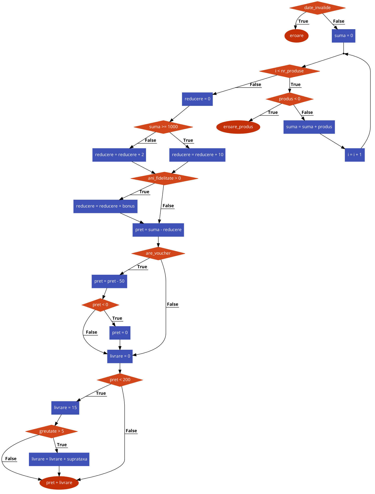

# Testarea Sistemelor Software - T3 Testare unitară în Java - JUnit 5 
**Membrii echipei:**
 - Bunescu Robert
 - Furtuna Vlad

---

## 1. Configurația Mediului de Testare

### 1.1 Configurația Hardware
Compatibil cu majoritatea configuratiilor hardware. A fost rulat pe:
* **Sistem de operare:** macOS Tahoe
* **Procesor (CPU):** Apple M1
* **Memorie RAM:** 16 GB

### 1.2 Configurația Software și Versiuni Tool-uri
Proiectul folosește **Maven** ca utilitar de build și management al dependențelor.
* **Java (JDK):** Versiunea 24
* **Framework de testare:** JUnit Jupiter (JUnit 5) - Versiunea `5.13.4`
* **Acoperire de cod (Code Coverage):** JaCoCo Maven Plugin - Versiunea `0.8.14`
* **Testare pe bază de mutanți (Mutation Testing):** PITest Maven Plugin - Versiunea `1.19.4` (cu extensia `pitest-junit5-plugin` versiunea `1.2.3`)

### 1.3 Comenzi de Rulare a Testelor și Generare Rapoarte
Pentru a reproduce mediul și a vizualiza rapoartele din consolă, se vor folosi următoarele comenzi în directorul rădăcină al proiectului:

**A. Rulare teste și generare raport de acoperire (JaCoCo):**
1. Executarea testelor și construirea raportului:
```bash
mvn clean test
```

2. Deschiderea raportului JaCoCo (pe macOS/Linux):
```bash
open target/site/jacoco/index.html
```


*(Pentru Windows se poate folosi `start target/site/jacoco/index.html`)*

**B. Rulare generare mutanți (PITest):**

1. Rularea analizei de mutații:
```bash
mvn org.pitest:pitest-maven:mutationCoverage -DtargetClasses='proiect_testare.*' -DtargetTests='proiect_testare.*'

```


2. Deschiderea raportului PITest:
```bash
open target/pit-reports/index.html

```

---

## 2. Diagrame

### 2.1 Graficul de Flux de Control (Control Flow Graph)

Mai jos este reprezentat graficul fluxului de control pentru metoda principală `calculeazaPretFinal`, ilustrând deciziile logice (evaluare coș, praguri de reducere VIP/Fidelitate, aplicare voucher și calcul costuri de livrare).
<p align="center">
  
</p>

---

## 3. Strategii de Testare Aplicate

### 3.1 Partiționare în clase de echivalență

Am împărțit domeniul datelor de intrare în clase valide și invalide, asumând că datele din aceeași clasă sunt procesate identic de `ProcesorComanda`.

* **Clase Invalide:** Array-uri nule/goale pentru prețuri, greutate negativă, ani de fidelitate negativi.
* **Clase Valide:** Comenzi de valoare mică/mare, clienți VIP vs. standard, utilizarea voucherului vs. neutilizare.
* *Implementare:* Clasa `ProcesorComandaEPTest`.

### 3.2 Analiza valorilor de frontieră (BVA)

Ne-am concentrat pe limitele claselor de echivalență (unde apar de obicei erori de tipul `<` în loc de `<=`).

* **Pragul de reducere de 10%:** Testat exact la `1000.0` (acordă 10%) și la `999.9` (acordă 2%).
* **Greutatea coletului (suprataxă):** Testat la `0.0`, `5.0` (limită fără suprataxă) și `5.1` (aplicare suprataxă de 2 lei/kg).
* **Livrare gratuită:** Pragul sumei post-reducere testat la valoare sub `200` și peste `200`.
* **Plafonare Fidelitate:** Verificarea reducerii de fidelitate maximă la anii 4, 5 (limită) și 6 (peste limită, plafonat la 5%).
* *Implementare:* Clasa `ProcesorComandaBVATest`.

### 3.3 Acoperire la nivel de instrucțiune, decizie și condiție

* **Instrucțiune & Decizie:** Toate ramurile (`if`/`else`) au fost vizitate măcar o dată (ex. intrare pe ramura de voucher valabil, clamparea valorii negative la 0.0 etc.).
* **Condiție (Condition Coverage):** Am analizat deciziile compuse (ex: `if (sumaInitiala >= 1000.0 || isVIP)` și `if (aniFidelitate > 0 && !isVIP)`). Am creat teste specifice pentru a evalua independența clauzelor (ex: C1 True și C2 False, urmat de C1 False și C2 True), demonstrând că fiecare condiție individuală dictează rezultatul expresiei logice.
* *Implementare:* Clasa `ProcesorComandaWhiteBoxTest`.

### 3.4 Circuite independente

Pe baza complexității ciclomatice a funcției (calculată prin formula lui McCabe, $V(G) = E - N + 2P$), am conceput teste care să urmeze trasee (path-uri) independente. De exemplu, un circuit testează scenariul critic care ocolește reducerea mare, nu aplică voucher, dar aplică dublă penalizare (taxă de livrare standard + suprataxă de greutate extremă).

---

## 4. Analiza Mutanților (Mutation Testing)

Am utilizat PITest pentru a injecta mutanți artificiali (defecte) în codul sursă. Scopul a fost ca testele noastre să pice (să "ucidă" mutantul) la întâlnirea acestor modificări.

### 4.1 Captură de ecran cu rezultatul inițial

*[ todo - imagine cu raportul PITest fara teste de mutanti ]*

### 4.2 Comparație Mutanți

Mai jos sunt prezentați doi mutanți neechivalenți care au supraviețuit inițial și pe care i-am eliminat adăugând teste stricte de white-box.

| Linia Modificată | Mutant Injected de PITest | Explicație & Testul care îl ucide | Status |
| --- | --- | --- | --- |
| `if (sumaInitiala >= 1000.0)` | A schimbat `>=` cu `>` (Conditionals Boundary) | Testul `testMutation_UcideMutantStrictMaiMare` trimite exact suma 1000.0. Mutantul acorda doar 2% (în loc de 10%), forțând `assertEquals(900.0, ...)` să pice. | **KILLED** |
| `Math.min(aniFidelitate * 0.01, 0.05)` | A schimbat apelul `Math.min` cu `Math.max` | Testul `testMutation_UcideMutantMathMinMax` folosește 1 an de fidelitate. Mutantul aplica direct 5% (max), în loc de 1% (min), forțând testul să pice pe calculul final. | **KILLED** |
| `sumaDupaReducere -= 50.0;` | A schimbat scăderea `-=` cu adunare `+=` | Testul `testMutation_UcideMutantPlusMinusVoucher` folosește un voucher pe un coș valid. Mutantul crește prețul în loc să-l scadă, picând aserția sumei finale. | **KILLED** |

### 4.3 Captură de ecran cu rezultatul final

*[ todo - imagine cu raportul PITest cu mutation coverage ridicat ]*

---

## 5. Raport privind Utilizarea Inteligenței Artificiale

Pentru realizarea acestui proiect, am utilizat asistență AI (Gemini) având următoarele roluri:

* **Generare boilerplate:** Structurarea inițială a claselor de test (setup JUnit 5).
* **Formatare:** Generarea scheletului curent în format Markdown.

---

## 6. Prezentare și Demo

*[ powerpoint ]*

---

## Bibliografie

1. Curs 1: Testare Funcțională (Black-Box: EP, BVA).
2. Curs 2: Testare Structurală (White-Box: CFG, Coverage Instrucțiuni/Decizii/Condiții, Ciclomatică McCabe).
3. Documentație oficială JUnit 5: https://junit.org/junit5/docs/current/user-guide/
4. Documentație oficială PITest: https://pitest.org/quickstart/maven/
5. Documentație oficială JaCoCo: https://www.jacoco.org/jacoco/trunk/doc/maven.html